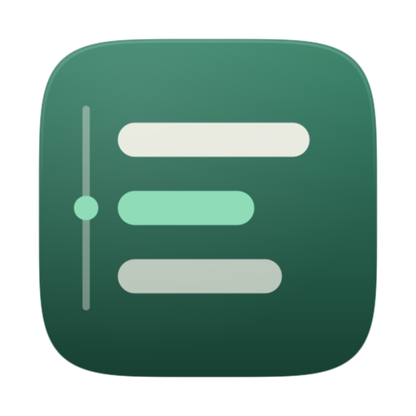
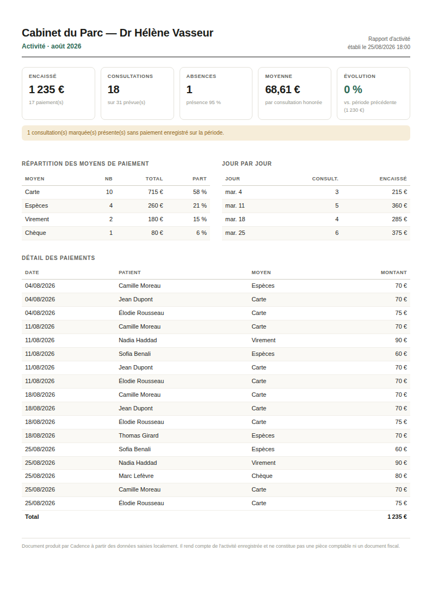

<div align="center">
  
  <h1>Cadence</h1>
  <p><strong>Le poste de travail d'une psychologue, pour macOS.</strong><br>
  Agenda, présences, paiements, historique et statistiques — hors ligne, sur son Mac, sans abonnement.</p>
</div>

---

## La boucle centrale

Toute l'application est construite autour d'une seule séquence, et tout ce qui
l'allonge en a été écarté :

```
J'ouvre Cadence  →  ma journée est déjà là  →  [Présent]  →  [70 € · Carte]  →  c'est enregistré
```

Le second geste est *proposé* : Cadence apprend, patient par patient, ce que chacun
paie réellement, et met sa combinaison habituelle en avant. Deux clics, ou deux
touches — `P` puis `⏎`.

## Ce qu'elle fait

- **Aujourd'hui.** Un rail chronologique de la journée, une ligne « maintenant », le
  prochain rendez-vous annoncé en clair. Présent, absent, démarrer, terminer.
- **Paiement habituel.** Une statistique locale, expliquée à l'écran, qui identifie
  la combinaison montant + moyen de paiement de chaque patient et sait rester
  silencieuse quand elle ne sait pas encore.
- **Agenda.** Les rendez-vous d'Apple Calendar *et* de Google Calendar arrivent tout
  seuls, sans OAuth et sans qu'aucune donnée ne quitte le Mac.
- **Patients.** Une fiche par personne : historique, présences, absences, paiements,
  montant habituel, rythme de consultation, créneau habituel.
- **Finances.** Jour, semaine, mois, année : encaissé, consultations, absences,
  répartition des moyens de paiement, évolution. Export CSV et rapport PDF réels.
- **Recherche.** `⌘K` atteint n'importe quel patient, rendez-vous ou action.
- **Annulation globale.** `⌘Z` sur 50 actions — c'est ce qui permet à Cadence de se
  passer entièrement de fenêtres « Êtes-vous sûr ? ».

Tout fonctionne sans connexion Internet. Rien n'est envoyé nulle part.

## Installation

Il faut un Mac sous **macOS 14 (Sonoma)** ou plus récent, et les **Xcode Command Line
Tools** (gratuits, `xcode-select --install`). Rien d'autre : aucune dépendance à
télécharger, aucun compte, aucun abonnement.

```bash
git clone https://github.com/Th3-Dud3-Man/desk-companion.git
cd desk-companion
./build.sh --install --run
```

`build.sh` compile, assemble `Cadence.app`, y place l'icône, signe le bundle en ad
hoc — ce qui permet à macOS de retenir l'autorisation d'accès au calendrier d'une
reconstruction à l'autre — puis l'installe dans `/Applications` et la lance.

```
./build.sh            construit dans ./build/Cadence.app
./build.sh --debug    build de développement
./build.sh --install  copie aussi dans /Applications
./build.sh --run      lance l'application
```

Chaque commit est également compilé par l'intégration continue sur un vrai runner
macOS, qui publie `Cadence.app` en artefact téléchargeable — utile pour vérifier
qu'une version donnée se construit bien sans avoir à le faire soi-même.

## Premier lancement

Trois étapes, toutes facultatives : le nom du cabinet et le tarif habituel, l'accès
au calendrier, puis un choix entre partir d'une base vide ou installer des données de
démonstration.

Les données de démonstration comptent huit patients fictifs avec plusieurs mois
d'historique et des habitudes de paiement différentes. Elles sont marquées
séparément et se retirent d'un clic dans Réglages › Données, sans jamais toucher aux
vraies données.

### Connecter Google Calendar

Ajoutez le compte Google dans **Réglages Système › Comptes Internet**, en activant
« Calendriers ». Ses calendriers apparaissent alors dans Cadence exactement comme
ceux d'iCloud. Il n'y a pas d'étape supplémentaire, pas d'autorisation OAuth à
accorder à Cadence, et aucune requête vers Google n'est faite par l'application :
c'est macOS qui gère le compte, Cadence lit ce que le système expose.

## Raccourcis

| | |
|---|---|
| `⌘1` … `⌘5` | Aujourd'hui · Agenda · Patients · Finances · Réglages |
| `⌘K` | Recherche et actions |
| `↑` `↓` | Se déplacer dans la journée |
| `P` / `A` | Marquer présent / absent |
| `⏎` | Valider le paiement proposé |
| `⌘T` | Revenir à aujourd'hui |
| `⌥⌘←` `⌥⌘→` | Jour précédent / suivant |
| `⌘N` / `⇧⌘N` | Nouveau rendez-vous / nouveau patient |
| `⌘R` | Synchroniser l'agenda |
| `⌘Z` / `⇧⌘Z` | Annuler / rétablir |
| `⌘/` | Rappel des raccourcis |

### Le rapport d'activité

Produit à partir des données réellement saisies, prêt à imprimer ou à transmettre.
Le rendu ci-dessous est celui du jeu de démonstration, généré par le code du dépôt :



## Vos données

Un fichier SQLite dans `~/Library/Application Support/Cadence/`, et rien d'autre.
Aucun serveur, aucun compte, aucune connexion réseau — l'application ne contient
aucun client HTTP. Un instantané est pris automatiquement au premier lancement de
chaque jour ; les quatorze derniers sont conservés et restaurables depuis les
Réglages.

Le détail complet — ce qui est stocké, ce qui ne l'est pas, la question du
chiffrement, comment tout supprimer — est dans [docs/DONNEES.md](docs/DONNEES.md).

## Sous le capot

| | |
|---|---|
| Langage | Swift 5.9+, SwiftUI et AppKit |
| Stockage | SQLite système, mode WAL, écritures synchrones |
| Calendrier | EventKit, en lecture seule |
| Dépendances tierces | **aucune** |
| Coût d'exploitation | **zéro** |

Le projet est coupé en deux : `CadenceCore` contient tout le domaine — stockage,
moteur d'habitudes, statistiques, rapprochement calendrier, exports — et n'importe
que Foundation, ce qui lui permet de se compiler et de s'exécuter sur Linux. Le
module `Cadence` est la coquille macOS. Cette frontière n'est pas cosmétique : elle
signifie que la logique métier est testée en intégration continue à chaque commit,
indépendamment de l'interface.

Le raisonnement complet derrière ces choix — pourquoi EventKit plutôt que l'API
Google, pourquoi SQLite plutôt que SwiftData ou Core Data, comment les conflits de
synchronisation sont traités — est dans [docs/ARCHITECTURE.md](docs/ARCHITECTURE.md).
Le système de design est décrit dans [docs/DESIGN-SYSTEM.md](docs/DESIGN-SYSTEM.md).

## Tests

```bash
swift test
```

La suite couvre les dix scénarios d'acceptation du cahier des charges, le moteur
d'habitudes dans ses cas limites, la persistance à travers une fermeture et une
réouverture, la cohérence des statistiques avec les données saisies, les exports, les
sauvegardes, et surtout la synchronisation calendrier — dont les deux propriétés
essentielles sont vérifiées explicitement :

- un rendez-vous hebdomadaire ne se duplique jamais ;
- **un paiement enregistré n'est jamais détruit** parce qu'un événement de calendrier
  a bougé ou disparu.

## Un mot sur ce que Cadence n'est pas

Ce n'est pas un dossier patient informatisé, et le champ « notes » n'est pas prévu
pour des notes cliniques. Ce n'est pas un logiciel de comptabilité : les exports
servent à alimenter un tableur ou un comptable, ils ne constituent pas une pièce
comptable. Et aucune conformité réglementaire n'est revendiquée — le comportement
technique est documenté pour que chacun puisse en juger.
